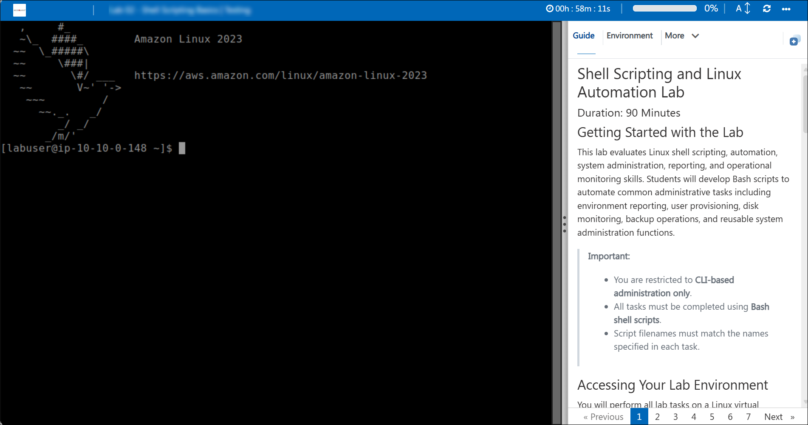
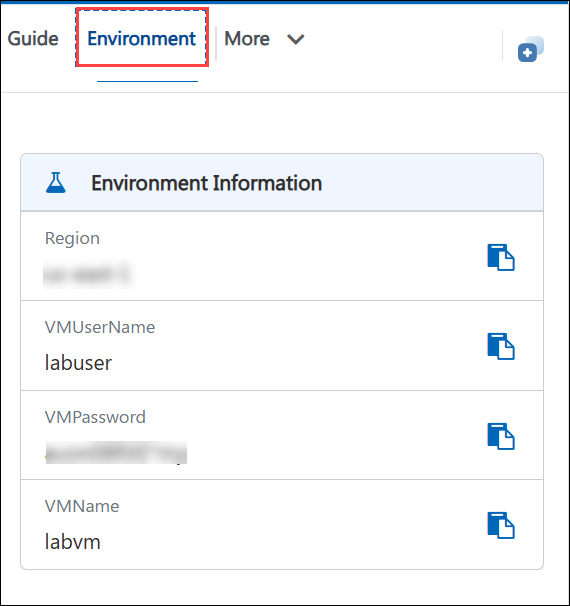
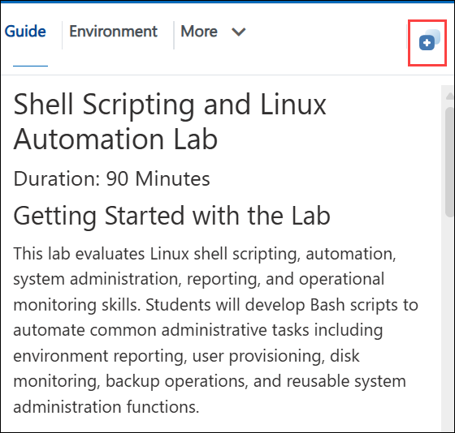
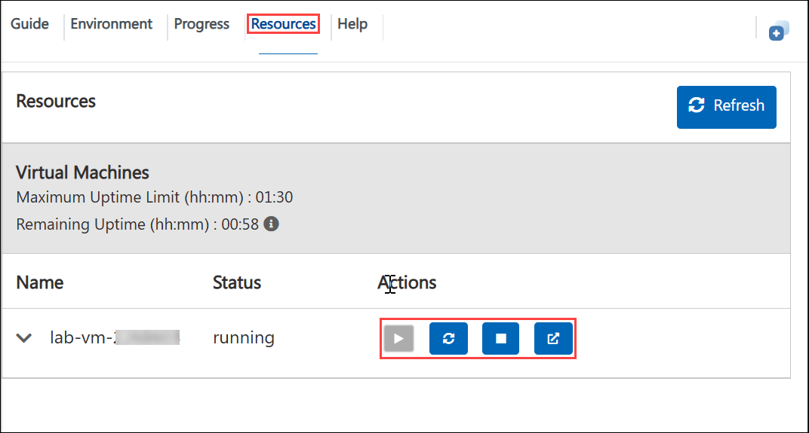
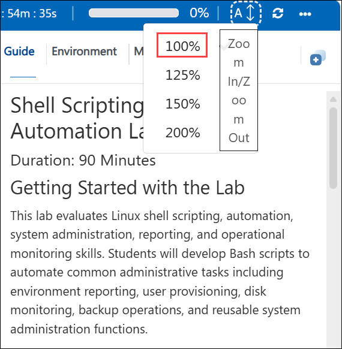
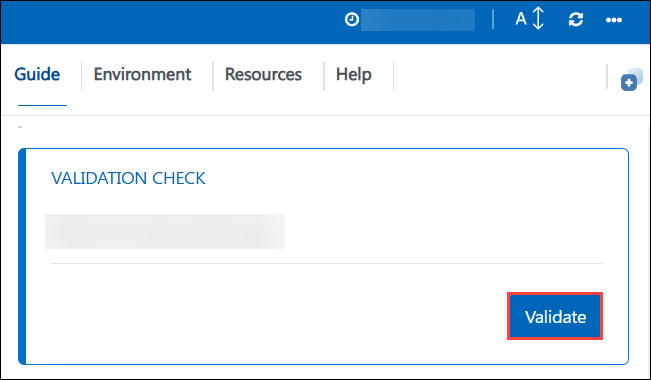

# Shell Scripting and Linux Automation Lab

### Duration: 90 Minutes

## Getting Started with the Lab

This lab evaluates Linux shell scripting, automation, system administration, reporting, and operational monitoring skills. Students will develop Bash scripts to automate common administrative tasks including environment reporting, user provisioning, disk monitoring, backup operations, and reusable system administration functions.

> **Important:**
>
> * You are restricted to **CLI-based administration only**.
> * All tasks must be completed using **Bash shell scripts**.
> * Script filenames must match the names specified in each task.

## Accessing Your Lab Environment

You will perform all lab tasks on a Linux virtual machine provisioned for this environment.

## Virtual Machine & Lab Guide

Your virtual machine is your workhorse throughout the workshop. The lab guide is your roadmap to success.

   

## Exploring Your Lab Resources
 
To get a better understanding of your lab resources and credentials, navigate to the **Environment** tab.

   

## Utilizing the Split Window Feature
 
For convenience, you can open the lab guide in a separate window by selecting the **Split Window** button from the Top right corner.

   

## Managing Your Virtual Machine
 
Feel free to **Start, Restart,** or **Stop** your virtual machine as needed from the **Resources** tab. Your experience is in your hands!

  

## Lab Guide Zoom In/Zoom Out
 
To adjust the zoom level for the environment page, click the **A↕: 100%** icon located next to the timer in the lab environment.

  

## Lab Validation

After completing the task, hit the **Validate** button under the Validation tab integrated within your lab guide. If you receive a success message, you can proceed to the next task; if not, carefully read the error message and retry the step, following the instructions in the lab guide.

   
   
## Support Contact

The CloudLabs support team is available 24/7, 365 days a year, via email and live chat to ensure seamless assistance at any time. We offer dedicated support channels tailored specifically for both learners and instructors, ensuring that all your needs are promptly and efficiently addressed.

Learner Support Contacts:

- Email Support: labs-support@spektrasystems.com
- Live Chat Support: https://cloudlabs.ai/labs-support

Now, click on **Next >>** from the lower right corner to move on to the next page.

