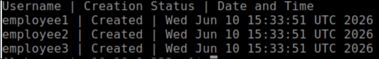

# Scenario 2 — Employee User Provisioning Automation

## Task 2: Automate Employee User Provisioning

### Lab Overview

The Human Resources department has onboarded several new employees and requires local Linux user accounts to be provisioned automatically using a reusable administrative script.

### Assessment Objectives

1. Create a Bash script named **create-users.sh**.
2. Create the following local user accounts:
```text
    employee1
    employee2
    employee3
```    
3. Assign the password for all user accounts.
4. Configure each account so that passwords never expire.
5. Handle scenarios where users already exist.
6. Display appropriate status messages for each operation.
7. Generate a report named **/home/labuser/reports/UserCreationReport.txt**.

### Report Requirements

The report must contain the following and in format as below.



<validation step="61ea68ec-bb38-4ac7-9d7b-05570c52834d" />

### Evaluation Criteria

* The script must execute without errors.
* All required user accounts are created successfully.
* Password expiration is disabled for all users.
* Validation must be Successful.
* The report file must be created successfully.
* The report must be stored at:

```text
/home/labuser/reports/UserCreationReport.txt
```
### You have successfully completed the Assessment.
