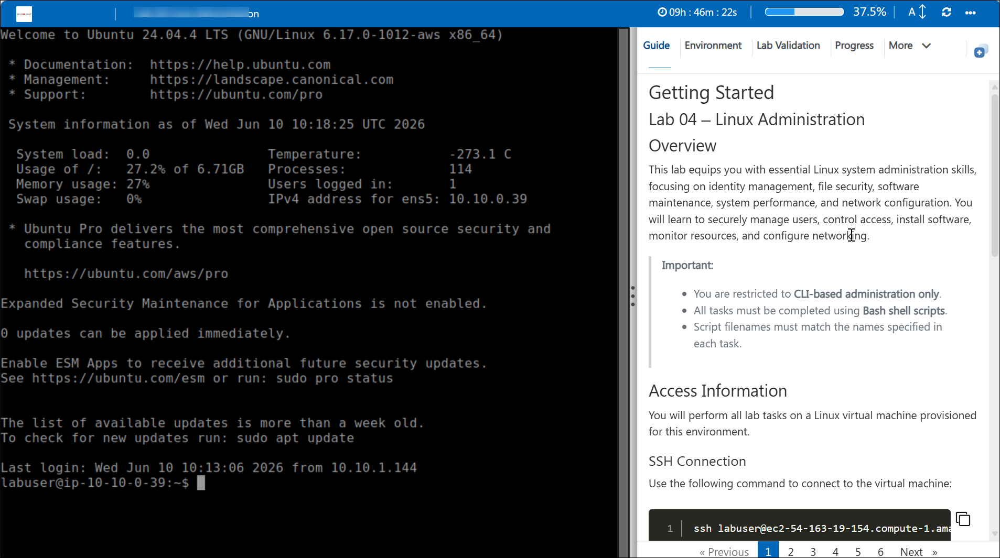
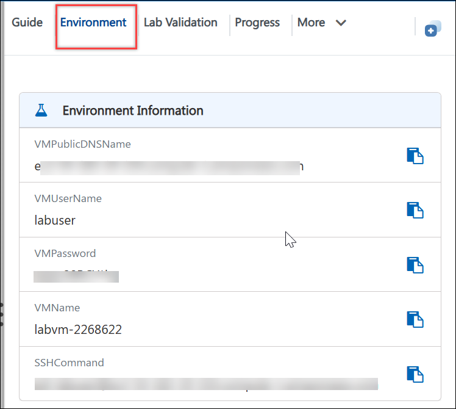
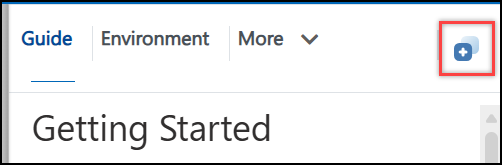
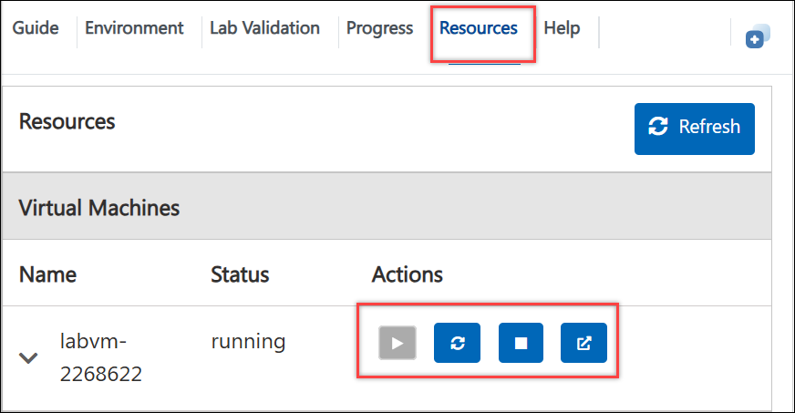
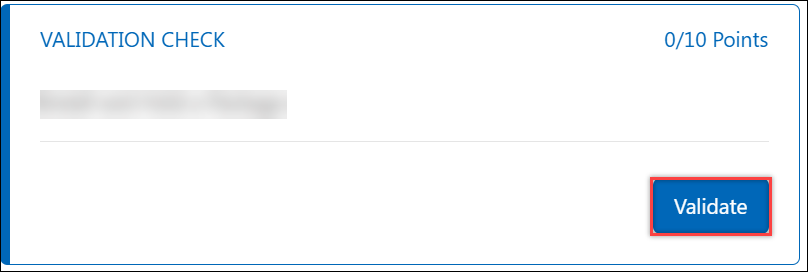

# Linux Administration
### Duration: 90 Minutes
## Getting Started with the Lab

## Overview

This lab equips you with essential Linux system administration skills, focusing on identity management, file security, software maintenance, system performance, and network configuration. You will learn to securely manage users, control access, install software, monitor resources, and configure networking.

> **Important:**
>
> * You are restricted to **CLI-based administration only**.
> * All tasks must be completed using **Bash shell scripts**.
> * Script filenames must match the names specified in each task.

## Access Information

* You will perform all lab tasks on a Linux virtual machine provisioned for this environment.
* Once you're ready to dive in, your virtual machine and guide will be right at your fingertips within your web browser.
  
  

## Exploring Your Lab Resources

To get a better understanding of your lab resources and credentials, navigate to the Environment tab.
  
  

## Utilizing the Split Window Feature

For convenience, you can open the lab guide in a separate window by selecting the Split Window button from the Top right corner.
  
  
  
## Managing Your Virtual Machine

Feel free to Start, Restart, or Stop your virtual machine as needed from the Resources tab. Your experience is in your hands!

  

## Lab Validation

After completing the task, hit the Validate button under the Validation tab integrated within your lab guide. If you receive a success message, you can proceed to the next task; if not, carefully read the error message and retry the step, following the instructions in the lab guide.

  

## Note

If you prefer not to use a browser-based terminal, you may connect to the virtual machine directly from your local computer using any SSH client, including:

* OpenSSH (Linux/macOS)
* Windows Terminal or PowerShell
* PuTTY

Use the SSH command and credentials provided above to establish the connection.

> **Important:** Ensure that your local network allows outbound SSH connections on port 22 before attempting to connect from your local machine.

> **Note**: It is highly advised to execute administrative operations and system tasks using a privileged administrator account rather than a standard, restricted user.

## Support Contact

The CloudLabs support team is available 24/7, 365 days a year, via email and live chat to ensure seamless assistance at any time. We offer dedicated support channels tailored specifically for both learners and instructors, ensuring that all your needs are promptly and efficiently addressed.

Learner Support Contacts:

* Email Support: labs-support@spektrasystems.com
* Live Chat Support: https://cloudlabs.ai/labs-support

Now, click on Next >> from the lower right corner to move on to the next page.

